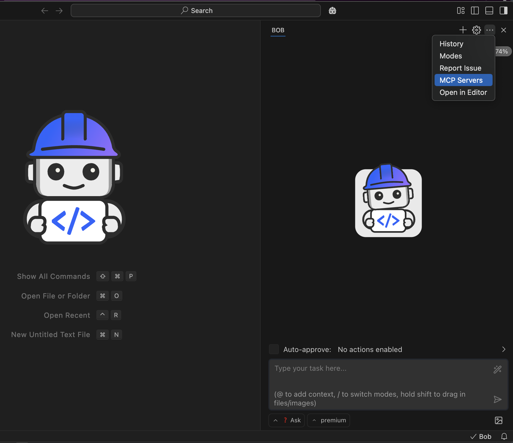
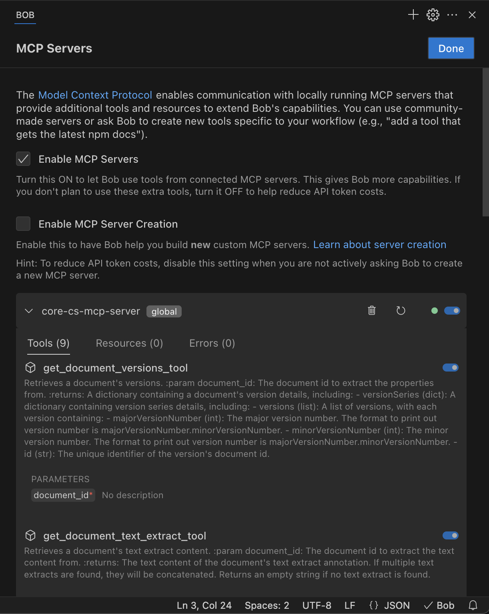

## Bob-IDE Configuration

1. Open Bob's MCP Server Settings:
   - In Bob's panel, click the **menu icon** (⋯) and select **MCP Servers**

     

2. Configure MCP Server:
   - Check the **Enable MCP Servers** checkbox
   - Click **Edit Global MCP Settings** to open the **mcp_settings.json** file and add one of the following configurations:

     **Option 1: Using local installation (if you've cloned the repository)**
     ```json
      {
        "mcpServers": {
          "core-cs-mcp-server": {
            "command": "/path/to/your/uvx",
            "args": [
              "--from",
              "/path/to/your/cs-mcp-server",
              "core-cs-mcp-server"
            ],
            "env": {
              "USERNAME": "your_username",
              "PASSWORD": "your_password",
              "SERVER_URL": "https://your-graphql-server/content-services-graphql/graphql",
              "OBJECT_STORE": "your_object_store"
            }
          }
        }
      }
     ```

     **Option 2: Installing directly from GitHub (recommended)**
     ```json
     {
      "mcpServers": {
        "core-cs-mcp-server": {
          "command": "uvx",
          "args": [
            "--from",
            "git+https://github.com/ibm-ecm/cs-mcp-server",
            "core-cs-mcp-server"
          ],
          "env": {
            "USERNAME": "your_username",
            "PASSWORD": "your_password",
            "SERVER_URL": "https://your-graphql-server/content-services-graphql/graphql",
            "OBJECT_STORE": "your_object_store"
          }
        }
      }
     }
     ```

3. Check Available Tools:
   - In the MCP Server settings page, you should see the **core-cs-mcp-server** loaded with a green indicator. Click it to view all available tools in a dropdown.


     

> **Important:** To use the MCP Server tools in Bob, ensure you're in **Ask mode**.

> **Note:** The JSON configuration examples above show only the minimum required environment variables. For a complete list of all possible configuration options, refer to the Environment Variables tables above.
